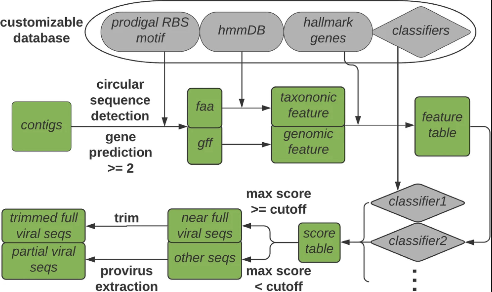
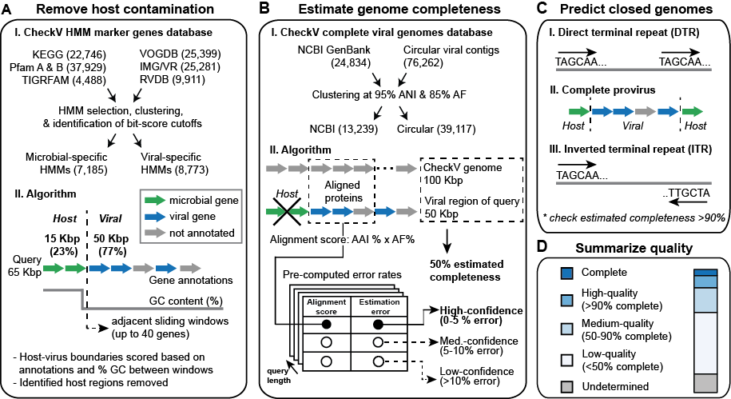
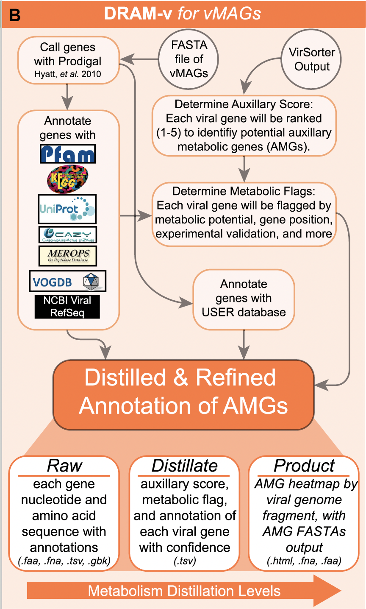
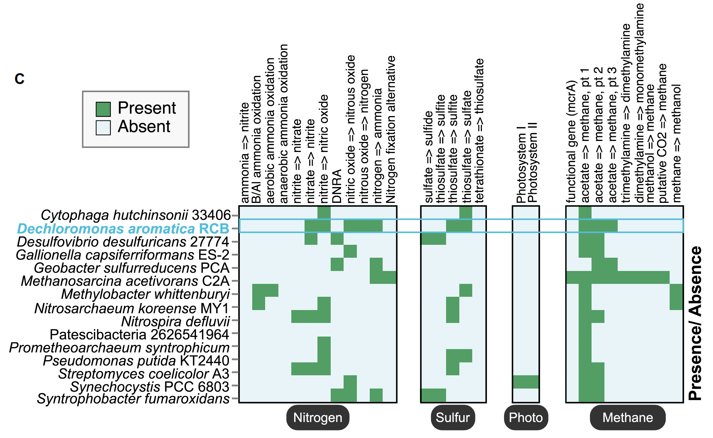
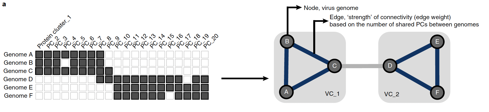

# Introduction to identifying viral sequences in bulk metagenomic data

author: "David B. Stern, Ph.D."  
[Bioinformatics and Computational Biosciences Branch](https://bioinformatics.niaid.nih.gov/)

Navigation links
* [Setting up the working directory]()


## Learning Objectives:

* Highlight LOCUS resources for viral metagenomic analyses
* Discuss approaches and bioinformatic tools for viral sequence identification in metagenomic assemblies
* Implement a simplified workflow to identify phage sequences in metagenomic data including:
    * Classification of metagenomic contigs as viral / non-viral
    * Genome quality assessment
    * Gene annotation
    * Taxonomic classification (if time allows)

Much of this workflow was adapted from the [Sullivan Lab](https://u.osu.edu/viruslab/) [SOP](https://www.protocols.io/view/viral-sequence-identification-sop-with-virsorter2-5qpvoyqebg4o/v3?version_warning=no)


## Start interactive session and set up working directory

[Link to temporary account information](https://nih-my.sharepoint.com/:x:/g/personal/sterndb_nih_gov/EcAbW7ESV9JOsFFtR1Q9fJsBiwMBSiqjJgAdd4A9aYKNSQ?e=hxL0rq&wdLOR=c7C88D67F-EBFA-E94B-9009-9C8DA514C2FB)

First, we will connect to LOCUS and start an interactive compute session. It is import not to run code on the submit nodes. All computation should be run through batch or interactive jobs (https://locus.niaid.nih.gov/userportal/documentation.php#Getting-Started/HPC-Basics)

```bash
ssh <username>@ai-submit1.niaid.nih.gov
qrsh -pe threaded 8 -l h_vmem=2G
```

The workflow is designed to take place after metagenome assembly (as in the Metagenomics I webinar). For this tutorial, we are using a very small subset (5 sequences) that was output from the previous session (i.e. sample 6 from the CAMI dataset).

Let's copy the data to a working directory

```bash
#create working directory
mkdir viral_metagenomics_training
cd viral_metagenomics_training

# if using training account ->
    cp /classhome/classroom/test.fa .
# if using personal account
    cp /hpcdata/scratch/viral_metagenomics_training/test.fa .
```

Take a quick look at the data

```bash
less test.fa
```

## Run VirSorter2


[VirSorter](https://microbiomejournal.biomedcentral.com/articles/10.1186/s40168-020-00990-y) is a multi-classifier method that uses genomic features to assign sequences a 'viralness' score. This applied both to the whole sequence and to sliding windows to identify partial viral sequences (e.g. proviruses). Importantly, different random-forest classifiers were trained for five different groups of viruses with different genomic characteristics, biology, evolutionary origins, etc. (dsDNA phages, NCLDV, RNA, ssDNA, Laviviruses)

### Three steps performed automatically:  
1. Preprocess sequences and identify circular contigs
2. Extract features from input sequences
    - CDS identification with [Prodigal](https://bmcbioinformatics.biomedcentral.com/articles/10.1186/1471-2105-11-119) and annotated with [HMMER3](http://hmmer.org/) against [Pfam](https://pfam.xfam.org/) and custom viral database
        - Manually annotated "viral hallmark genes" specific to each viral group, e.g. major capsid protein (MCP) and terminase large subunit for Caudovirales
        - Genes assigned to virus, bacteria, archaea, eukaryotes, mixed
    - Gene size, density, and overlapping frequency
    - Strand switching frequency
    - Start codon usage
    - GC content
    - Ribosomal binding site motifs
3. Score each sequence independently using a set of classifiers customized for different viral groups
    - Random forest classifiers trained on high-quality reference genomes
    - Aggregate scores into a single prediction

VirSorter2 is a written as a [SnakeMake](https://snakemake.readthedocs.io/en/stable/) workflow, and each step of the workflow is printed to the screen when running.

The main command is `virsorter run` and has several options that can be viewed by typing `virsorter run -h`

```bash
module load virsorter/2.2.3-Python-3.8.10
# The reference database is already downloaded and configured on Locus here: /hpcdata/bio_data/virsorter/db-2.2.3/
# If it were not, the command to download and configure the database is:
# virsorter setup -d /path/to/database/db-vs2 -j 8

virsorter run -i test.fa -w vs2-pass1 --keep-original-seq --include-groups dsDNAphage,ssDNA --min-length 1000 --min-score 0.5 -j 8 all

module unload virsorter/2.2.3-Python-3.8.10

```

Flags:
- `-i test.fa`: specify name and path to input file (metagenome assembly)
- `-w vs2-pass1`: specify name and path to output directory  
- `--keep-original-seq`: partial viral sequences are not trimmed from the whole contig. Instead we will use CheckV to remove cellular sequence and identify proviruses.
- `--include-groups dsDNAphage,ssDNA`: specify which classifiers to use. It is recommended to only specify the groups of your particular interest, if possible, to avoid false positives.
- `min-length 1000`: remove sequences shorter than 1000 bp
- `--min-score 0.5`: VirSorter2 suggests that a score above 0.9 is strong evidence that the sequence is viral. However, we will be using a low cutoff to capture more sequences of putative viral origin and use CheckV to collect additional information.
- `-j 8`: maximum number of jobs to allow in parallel
- `all`: run all three steps. Alternatively, one could run just the `classify` step if the previous steps had already been run, and one wished to adjust filtering options.

This produces several output files in vs2-pass1 directory:
- final-viral-score.tsv: contig information and scores
View with: `column -t vs2-pass1/final-viral-score.tsv`

This table can be used for further screening of results. It includes the following columns:
  >   - sequence name
  >   - score of each viral sequences across groups (multiple columns)
  >   - max score across groups
  >   - max score group
  >   - contig length
  >   - hallmark gene count
  >   - viral gene %
  >   - nonviral gene %

- final-viral-combined.fa: all viral sequences in fasta format
View the first 2 lines with: `head -2 vs2-pass1/final-viral-combined.fa`
Identified viral sequences, including three types:
  > - full sequences identified as viral (identified with suffix `||full`);
  > - partial sequences identified as viral (identified with suffix `||{i}_partial`); here `{i}` can be numbers starting from 0 to max number of viral fragments found in that contig;
  > - short (less than two genes) sequences with hallmark genes identified as viral (identified with suffix `||lt2gene`);

- final-viral-boundary.tsv: table with ORF coordinates and information

 > only some of the columns in this file might be useful:
  >   - seqname: original sequence name
  >   - trim\_orf\_index\_start, trim\_orf\_index\_end:  start and end ORF index on orignal sequence of identified viral sequence
  >   - trim\_bp\_start, trim\_bp\_end:  start and end position on orignal sequence of identified viral sequence
  >   - trim\_pr: score of final trimmed viral sequence
  >   - partial:  full sequence as viral or partial sequence as viral; this is defined when a full sequence has score > score cutoff, it is full (0), or else any viral sequence extracted within it is partial (1)
  >   - pr\_full:  score of the original sequence
  >   - hallmark\_cnt:  hallmark gene count
  >   - group: the classifier of viral group that gives high score; this should **NOT** be used as reliable classification

Sequence names are appended with `||full` or `{i}_partial`. `||full` means that the entire contig has strong viral signal, while `{i}_partial` sequences have some viral and some cellular signal.


## CheckV
Assess quality and completeness of viral sequences identified with VirSorter2 and trim host regions left at the end of proviruses



[CheckV](https://www.nature.com/articles/s41587-020-00774-7) estimates completeness of viral genomes assembled from metagenomic data and also removes host (microbial) contamination. Alternative methods include [VIBRANT](https://microbiomejournal.biomedcentral.com/articles/10.1186/s40168-020-00867-0) which assesses completeness based on viral hallmark genes and [viralComplete](https://academic.oup.com/bioinformatics/article/36/14/4126/5837667) which compares sequence length to related sequences in NCBI RefSeq.

CheckV has several modules, each with their own set of options that can be viewed with `checkv -h`. CheckV is a pipeline that consists of several modules:
- Identify and remove host contamination
    - Annotates genes as viral or microbial based on comparison to large database of HMMs
    - Compares genes in adjacent windows to identify viral-host boundaries as large shift in gene content or nucleotide composition
- Estimate completeness for genome fragments
    - Estimates expected genome length based on average amino-acid identity (AAI) to database of viral genomes from NCBI
    - With novel, high-diverged viruses uses HMM method
        - Contig length is compared to that of reference genomes that are annotated by the same viral HMMs
        - Reports range of completeness values
- Predict closed genomes based on terminal repeats and flanking host regions
- Classify into quality tiers based on completeness

Running `checkv end_to_end` will run the entire pipeline of estimating completeness, contamination, and identify closed genomes.

Flags for `checkv end_to_end`:
- `vs2-pass1/final-viral-combined.fa`: specify path to input file (putative viral sequences)
- `checkv`: path to output directory
- `-t 8`: Number of threads to use for Prodigal and DIAMOND
- `-d /hpcdata/bio_data/checkv/checkv-db-v1.0`: path to reference databases

```bash
module load checkv/0.8.1
# The reference database is already downloaded and configured on Locus here: /hpcdata/bio_data/checkv/checkv-db-v1.0/
# If it were not, the command to download and configure the database is:
# checkv download_database

checkv end_to_end vs2-pass1/final-viral-combined.fa checkv -t 8 -d /hpcdata/bio_data/checkv/checkv-db-v1.0

# concatenate viral sequences extracted from mostly bacterial sequence (proviruses) and contigs that are mostly viral
cat checkv/proviruses.fna checkv/viruses.fna > checkv/combined.fna

module unload checkv/0.8.1
```

This produces several output files in the checkv directory:

* viruses.fna
Contigs that are mostly viral
* proviruses.fna  
Viral sequences extracted from contigs that are mostly microbial


* quality_summary.tsv
View with `column -t checkv/quality_summary.tsv`
This contains integrated results from the three main modules and should be the main output referred to.

> - contig length
> - whether or not the viral sequence is called a provirus
> - length of the proviral sequence
> - total number of genes identified
> - number of viral genes
> - number of host genes
> - CheckV quality tier
> - MIUVIG quality tier
> - estimated completeness
> - method used to estimate completeness
> - percent of contig estimated to be of non-viral origin
> - kmer-freq (number of times the viral genome is found in the contig)

* completeness.tsv  
A detailed overview of how completeness was estimated

* contamination.tsv  
A detailed overview of how contamination was estimated.

* complete_genomes.tsv  
A detailed overview of putative complete genomes identified.

Additional information about these files can be found in the [CheckV code repository](https://bitbucket.org/berkeleylab/checkv)

## Run DRAMv
Perform gene annotation and help filter some false-positive



[DRAM](https://academic.oup.com/nar/article/48/16/8883/5884738) is a gene annotation tool for bacterial and viral (DRAM-v) genomes. It is quite useful for our purposes for several reasons:
1. Searches predicted genes against multiple databases for functional information, including some virus-specific
    * Pfam, KEGG, Uniprot, dbCAN, CAZY, MEROPS, VOGDB, NCBI Viral refseq
2. Distills and summarizes annotations into functional pathways
3. Identifies auxiliary metabolic genes (AMGs)
    * Uses VirSorter2 output to help confirm viral origin of metabolic genes


First, we need to run VirSorter2 again on the CheckV output to generate the input files for DRAM-v.

```bash
module load dram/1.3.4-Python-3.10.4
module load virsorter/2.2.3-Python-3.8.10

virsorter run --seqname-suffix-off --viral-gene-enrich-off --provirus-off --prep-for-dramv -i checkv/combined.fna -w vs2-pass2 --include-groups dsDNAphage,ssDNA --min-length 1000 --min-score 0.5 -j 8 all

```

**no need to run `DRAM-v.py annotate` now, it will take too long**

Instead let's look at the command options, and work with some pre-computed output.

```bash
# The reference databases are already downloaded and configured on Locus here: /hpcdata/bio_data/DRAM/DRAM_data/
# If it were not, the command to download and configure the database is:
# DRAM-setup.py prepare_databases --skip_uniref --output_dir <path/to/directory>

DRAM-v.py -h
DRAM-v.py annotate -h
```

Flags for `DRAM-v.py annotate`:
- `-i vs2-pass2/for-dramv/final-viral-combined-for-dramv.fa`: specify path to input file (formatted file of viral sequences)
- `-v vs2-pass2/for-dramv/viral-affi-contigs-for-dramv.tab`: VirSorter VIRSorter_affi-contigs.tab output file
- `-o dramv-annotate`: path to output directory
- `--skip_trnascan`: skip search for transfer RNA sequences to save time
- `--min_contig_size 1000`: minimum size of contig to analyze

```bash
# command to run dramv annotate
## does not need to be run --> too slow
#DRAM-v.py annotate -i vs2-pass2/for-dramv/final-viral-combined-for-dramv.fa \
#                    -v vs2-pass2/for-dramv/viral-affi-contigs-for-dramv.tab \
#                    -o dramv-annotate --skip_trnascan --threads 8 --min_contig_size 1000

# instead copy precomputed output file
# if using training account
    cp -r /classhome/classroom/dramv-annotate .
# if using personal locus account
    cp -r /hpcdata/scratch/viral_metagenomics_training/dramv-annotate .
```

Output files in the dramv-annotate directory:

* annotations.tsv  
Tab separated file (.tsv) with all the annotations from Pfam, KEGG, UniProt, dbCAN, MEROPS, VOGDB, and a manually curated AMG database for all genes in all the input viral contigs. The final column contains the following annotation flags:
    *	(V) – viral, has VOGDB identifier
    *	(M) – metabolism, has metabolism identifier from the “Distillate”
    *	(K) – known AMG, annotated from the literature as AMG
    *	(E) – experimentally verified, similar to (K) but has been experimentally verified in previous study
        *	K and E are based on curated database of 257 and 12 genes, respectively
    *	(A) – attachment, associated with viral host attachment and entry
    *	(P) - peptidase
    *	(F) – near the end of the contig, within 5000bp of the end of a contig because less gene content to verify AMG
    *	(T) – transposon, may be non-viral genetic element
    *	(B) – 3 or more metabolic genes in a row indicating potentially non-viral stretch


* genbank/final-viral-combined-for-dramv.gbk  
Single GenBank file of annotations across viral contigs

* genes.gff  
Single gene-finding format (.gff) file of all annotations across viral contigs

* genes.fna  
Single fasta format file (.fna) of each open reading frame nucleotide sequence and best ranked annotation

* genes.faa
Single fasta format file (.faa) of each translated open reading frame amino acid sequence and best ranked annotation


Next, we can run `DRAM-v.py distill` to summarize pathway and AMG information

Key flags for DRAM-v.py distill:
- `-i dramv-annotate/annotations.tsv`: annotation input file from DRAM-v.py annotate
- `-o dramv-distill`: path to output directory
- `--max_auxiliary_score 3`: Metabolic genes are given a score designed to help determine whether the gene is truly encoded in a viral genome. This is based on surrounding genes and whether they are viral hallmark genes, viral-like, etc.


```bash
# run dramv distill
DRAM-v.py distill -i dramv-annotate/annotations.tsv -o dramv-distill --max_auxiliary_score 3

module unload dram/1.3.4-Python-3.10.4
module unload virsorter/2.2.3-Python-3.8.10
```

Output files:
* vMAG_stats.tsv
Contains summarized annotation information about each viral contig  

* amg_summary.tsv
Summary of AMGs from all input viral contigs

* product.html
Interactive heatmap summarizing AMG content across viral contigs. Our dataset was too small for this plot to be generated, but an example looks like this:


## Compile and filter results
Now we have output from VirSorter2, CheckV, and DRAM-v. Let's combine these results into a single table using R and filter to a set of high-confidence viral sequences.

Specifically, we will filter sequences based on the presence of viral + host genes, virsorter2 score, and 'suspicious genes', i.e. genes that are often found in viral and microbial genomes. These criteria come from the [Sullivan Lab](https://u.osu.edu/viruslab/) [SOP](https://www.protocols.io/view/viral-sequence-identification-sop-with-virsorter2-5qpvoyqebg4o/v3?version_warning=no).

```bash
module load R/4.1.0  
R
```

```R
 if (!require("dplyr", quietly = TRUE))
     install.packages("dplyr")
 if (!require("stringi", quietly = TRUE))
     install.packages("stringi")
 if (!require("stringr", quietly = TRUE))
     install.packages("stringr")
 library(dplyr)
 library(stringi)
 library(stringr)

 #` read in data
 vs2_res <- read.delim("vs2-pass1/final-viral-score.tsv",h=T)

 checkv_res <- read.delim("checkv/quality_summary.tsv",h=T)
 colnames(checkv_res)[1] <- "seqname"

 dramv_vMAG_stats <- read.delim("dramv-distill/vMAG_stats.tsv",h=T)
 dramv_vMAG_stats$seqname <- dramv_vMAG_stats$X %>%
                     str_replace('-.+','') %>%
                     str_replace('full_\\d','full') %>%
                     str_replace('partial_\\d','partial') %>%
                     stri_replace_last_fixed('__','||')

 #` merge tables
 res_tmp <- merge(vs2_res,checkv_res,by="seqname")
 res <- dramv_vMAG_stats %>%
         select(seqname,potential.AMG.count,Viral.genes.with.host.benefits) %>%
         merge(res_tmp,by="seqname")

#` filter by criteria suggested by Sullivan lab
keep1 <- res %>%
        filter(viral_genes > 0)
keep2 <- res %>%
        filter(viral_genes == 0 & (host_genes == 0 | max_score > 0.95 | hallmark > 2))

dramv_annotations <- read.delim("dramv-annotate/annotations.tsv",h=T)

suspicious_genes <- c('carbohydrate kinase',
'carbohydrate-kinase',
'glycosyltransferase',
'glycosyl transferase',
'glycosyl transferaseendonuclease',
'nucleotide sugar epimerase',
'nucleotide sugar-epimerase',
'nucleotide-sugar epimerase',
'nucleotide-sugar-epimerase',
'nucleotidyltransferase',
'nucleotidyl transferase',
'nucleotidyl-transferase',
'plasmid stability',
'endonuclease')

to_rm <- data.frame()
for (gene in suspicious_genes){
    out <- filter(dramv_annotations, grepl(gene,pfam_hits,ignore.case = TRUE))
    to_rm <- rbind(to_rm,out)
}

sus_contigs <- unique(to_rm$scaffold) %>%
    stri_replace_last_fixed("__","||") %>%
    str_replace("-cat.*","")

#` filter the keep2 list for suspicious genes
keep2_good <- filter(keep2, !seqname %in% sus_contigs)

final <- rbind(keep1,keep2_good)

write.table(final, 'good_viral_contigs.txt',quote=F,row.names=F,sep='\t')
```


Let's collect the viral sequences in fasta format

```bash
module load bbmap/38.90

cut -d $'\t' -f 1 good_viral_contigs.txt > keep_seqlist.txt

filterbyname.sh in=checkv/combined.fna out=good_viral_contigs.fa include=t substring=name names=keep_seqlist.txt
```

Our final high-confidence viral sequences are now in `good_viral_contigs.fa`.


## Assigning taxonomy with vConTACT2

Viruses do no have a single, universal marker gene (like 16S, ITS, COI) that can be used for phylogenetic or similarity-based taxonomic assignment (although group-specific markers do exist, e.g. RDP for RNA viruses).


[vConTACT2](https://www.nature.com/articles/s41587-019-0100-8) is clusters viral genomes into taxonomy-informative groups based on the idea that related viruses share more genes.


MCL is used to cluster protein sequences based on Diamond-based hit scores, and then ClusterONE is used for hierarchical clustering of viral genomes.

Each cluster gets two types of scores
1. Topology-based score which aggregates information about network topological properties
2. Taxonomy-based score which estimates the likelihood of predicted VC to be equivalent to a single ICTV genus
    * Used to automatically optimize the hierarchical clustering into ICTV-concordant ‘sub-clusters’

Ideally, we would include in our analysis additional reference databases in which we could 'place' our viral sequences. For simplicity, we will use the default reference database within vConTACT2.


First, we need to create the gene-to-genome mapping file for input to vConTACT2. We can use some of the output from `DRAMv.py annotate`.

```bash
module load vcontact2/0.9.19-Python-3.7.10
module load clusterone/1.0

# create gene-to-genome mapping file
awk -F '\t' '{print $1 "," $3 "," $25}' dramv-annotate/annotations.tsv | tail -n +2 - > g2g.tmp.csv
echo 'protein_id,contig_id,keywords' | cat - g2g.tmp.csv > g2g.csv  
```

**no need to run `vcontact2` now, it will take too long**

Key flags for running `vcontact2`:
- `--raw-proteins dramv-annotate/genes.faa`: path to protein sequences file, here generated with Prodigal within DRAM-v
- `--rel-mode 'Diamond'`: use Diamond to generate similarity scores between protein sequences
- `--proteins-fp g2g.dramv.csv`: gene to genome mapping file
- `--db 'ProkaryoticViralRefSeq201-Merged'`: name of reference database
- `--pcs-mode MCL --vcs-mode ClusterONE`: use MCL for protein clustering and ClusterONE for viral genome clustering
- `--c1-bin /sysapps/cluster/software/clusterone/1.0/cluster_one-1.0.jar`: path to the ClusterONE software
- `--output-dir vcontact_out`: path to the output directory

vConTACT2 has many options. See additional detail in the [code repository](https://bitbucket.org/MAVERICLab/vcontact2/wiki/Home).

```bash
# command to run vcontact2
# no need to run because very slow

#vcontact2 --raw-proteins dramv-annotate/genes.faa \
#            --rel-mode 'Diamond' \
#            --proteins-fp g2g.dramv.csv \
#            --db 'ProkaryoticViralRefSeq201-Merged' \
#            --pcs-mode MCL --vcs-mode ClusterONE \
#            --c1-bin /sysapps/cluster/software/clusterone/1.0/cluster_one-1.0.jar \
#            --output-dir vcontact_out

# instead copy precomputed output file
# if using training account
    cp -r /classhome/classroom/vcontact_out .
# if using personal locus account
    cp -r /hpcdata/scratch/viral_metagenomics_training/vcontact_out .
```

Two main output files in the `vcontact_out` directory are informative:
* genome_by_genome_overview.csv
Contains all the taxonomic information for **reference genomes**, as well as all the clustering information (initial VC (VC_22), refined VC (VC_22_1)), confidence metrics, and misc scores.

The authors of vConTACT2 suggest that if your quer sequence is in the same subcluster as a reference sequence, then it is likely in the same genus. If it is in the same VC, but not the same subcluster, as a reference, then it is likely related at a genus-subfamily level.  

* viral_cluster_overview.csv
Information about each viral cluster

Let's find the putative taxonomic assignments for our sequences.

```bash
# find the subclusters to which our genomes were assigned  
grep 'NODE' vcontact_out/genome_by_genome_overview.csv #cluster VC_233_0
# find the taxonomic information about the cluster
grep 'VC_233_0' vcontact_out/viral_cluster_overview.csv
grep 'VC_233_0' vcontact_out/genome_by_genome_overview.csv
```
